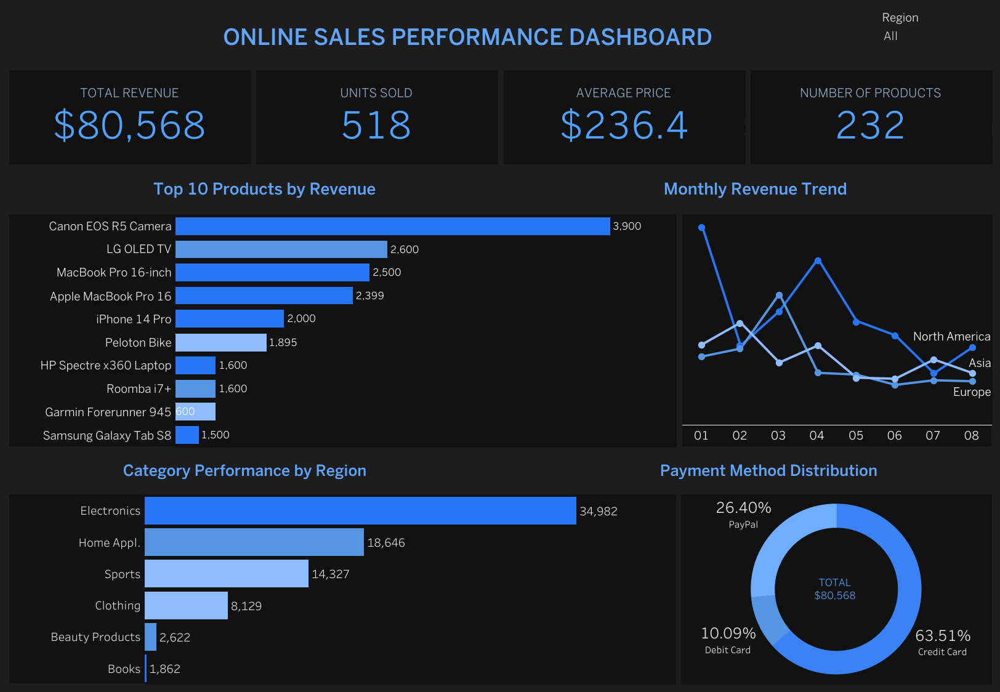

#  Online Sales Performance Dashboard

##  Live Dashboard

👉 [View on Tableau Public](https://public.tableau.com/views/Book1_17737261104450/Onlinesales?:language=en-US&:sid=&:redirect=auth&:display_count=n&:origin=viz_share_link)

---

##  Overview

This dashboard provides insights into online sales performance, including:

*  Total Revenue
*  Units Sold
*  Average Price
*  Number of Products

---

##  Key Visualizations

* Top 10 Products by Revenue
* Monthly Revenue Trend by Region
* Category Performance by Region
* Payment Method Distribution (Donut Chart)

---

##  Features

* Interactive filters by region
* Clean dark-themed UI
* Highlighted KPIs
* Donut chart with total revenue

---

## 🖼 Dashboard Preview

---

## 🛠 Tools Used

* Tableau Public
* Data Visualization
* Dashboard Design

---

## 🚀 Author

Sofia Kondovina
